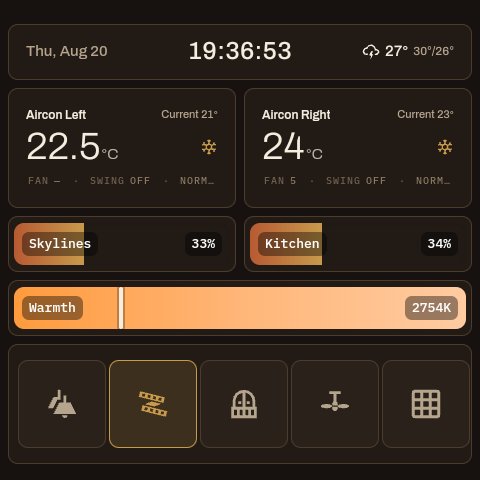
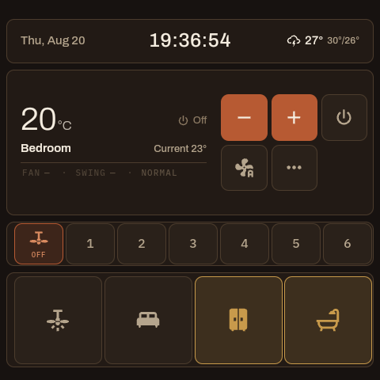

# nspanelpro-ha

A kiosk launcher that turns a Sonoff NSPanel Pro into a Home Assistant wall
panel. It boots straight into a dashboard, keeps it on screen, wakes on
approach, and reports enough about itself to be managed without a screwdriver.



The panel above is running the app full-screen; everything on it is a Home
Assistant dashboard. The app's job is to be the thing that never gets in the
way of it.

## Why this exists

The stock launcher gets you a browser. That is not the same as a wall panel:

- **It stays put.** The app registers as `HOME`, so a crash, a reboot or a
  stray tap lands back on the dashboard rather than an Android home screen.
- **It manages its own screen.** Dim on idle, wake on proximity, and a
  brightness that follows the room instead of blinding you at 3am.
- **It can be managed remotely.** Configuration arrives over ADB broadcast or
  MQTT, and every panel serves a diagnostics endpoint, so a fleet does not mean
  a stepladder.
- **It knows what it is.** Two hardware generations report proximity on
  incompatible scales; the app detects which it is on and adapts rather than
  making you configure it.

## Hardware

| Panel | Screen | CSS viewport | Android | WebView |
| --- | --- | --- | --- | --- |
| 86mm square (`px30_evb`) | 480×480 @160dpi | 480×480 | 8.1 / SDK 27 | Chromium 107 |
| 86mm square, newer (`PX30_Android11`) | 480×480 @160dpi | 480×480 | 11 / SDK 30 | Chromium 131 |
| 120mm US (`px30_evb`) | 750×1334 @240dpi | 500×889 | 8.1 / SDK 27 | Chromium 107 |

The 120mm is portrait, not a larger square, and at 240dpi its
`devicePixelRatio` is 1.5 — so its 1334 physical rows are only 889 CSS pixels.
A dashboard sized against the physical numbers comes out half again too large
there. It reports the same `px30_evb` model as the 86mm, so the model string
cannot distinguish them; the viewport can.

`minSdk` is 26, so other Android devices will run it — a tablet reports as
`UNKNOWN` and takes conservative defaults rather than guessing at hardware it
cannot identify.

Chromium 107 matters if you write your own cards: it predates `color-mix()`,
and it does not report `prefers-color-scheme: dark`, so those panels cannot
pick up Home Assistant's automatic dark theme. Set a theme per view instead.

<p align="center">
  
  
</p>

## Installing

### 1. Put the panel in developer mode

The panel needs ADB over the network, which Sonoff hides behind a developer
toggle in the eWeLink app. Enabling it is a one-time step per panel —
[Blakadder's sideloading guide](https://blakadder.com/nspanel-pro-sideload/)
walks through it (in short: eWeLink → device settings → tap **Device ID**
repeatedly until Developer Options appears, then enable ADB). Note the
warning in that guide: accepting the ADB agreement takes the panel off
Sonoff's official update path — which is rather the point here.

### 2. Install the app

Download `app-release.apk` from the latest release, then from any machine on
the same network:

```sh
PANEL=192.168.2.x        # your panel's IP

adb connect $PANEL:5555

# Retire anything that will fight for the screen. The stock control panel
# keeps itself resumed on a factory-fresh unit, which leaves whatever you
# install running behind it. It is a system app, so it disables rather
# than uninstalls.
adb -s $PANEL:5555 shell pm disable-user --user 0 com.eWeLinkControlPanel

# Install, grant the two permissions the app needs (hardware brightness
# and boot-launch), and make it the home screen.
adb -s $PANEL:5555 install -r app-release.apk
adb -s $PANEL:5555 shell appops set pro.nspanel.ha2 WRITE_SETTINGS allow
adb -s $PANEL:5555 shell appops set pro.nspanel.ha2 SYSTEM_ALERT_WINDOW allow
adb -s $PANEL:5555 shell cmd package set-home-activity pro.nspanel.ha2/.MainActivity

# Point it at your Home Assistant.
adb -s $PANEL:5555 shell am broadcast -a pro.nspanel.ha2.PUSH_CONFIG \
    -n pro.nspanel.ha2/.ConfigPushReceiver \
    --es ha_url "http://homeassistant.local:8123/your-dashboard/0"
```

> **Leave `com.eWeLinkNSPro.dev` alone.** It looks like vendor bloat; it is
> the panel's network stack. Disabling it takes the panel off the network
> entirely and the only way back is a factory reset. Learned the hard way.

Building from source needs a `keystore.properties` beside `settings.gradle.kts`
(see `keystore.properties.example`) and `./gradlew assembleRelease`.

> **Upgrades preserve settings only if the signing key matches.** An APK signed
> with a different key forces an uninstall, and an uninstall wipes the app's
> stored configuration — `ha_url` included, which leaves the panel on a blank
> screen until something pushes it back. Keep the key you started with, or plan
> to re-push config to every panel afterwards.

## The calibration wizard

Swipe down from the top of the screen and choose **Calibration wizard**. It
tunes the two things no shipped default can know — where the proximity
trigger sits on *this* panel's sensor, and what "bright" and "dark" mean in
*this* room — by asking you to do things and measuring while you do them:

1. **Step away** — measures the empty room's proximity reading.
2. **Stand at wake distance** — measures you where you want the panel to
   wake, and sets the trigger between the two. If the two readings are
   close, it says so and lets you decide; if the sensor reports nothing, or
   reads exactly the same with you there as without, it tells you plainly
   that the sensor is faulty rather than sending you on calibration errands
   that cannot succeed.
3. **Room bright, then room dark** — measures the lux at both, anchoring
   auto-brightness to the room's real range. The screen goes almost black
   during the dark measurement so its own glow doesn't pollute the reading.
4. **Dimming** — idle timeout and dim-level sliders, then a summary and
   Apply.

Every measuring step waits for a button press and counts down before
sampling, so you have time to get where the step needs you. Both sensors
read out live on every screen — wave a hand and watch the number move.
Everything the wizard writes lands in the ordinary settings, so results are
tunable by hand afterwards, and the wizard can be re-run whenever the room
or the furniture changes. Gen2 panels have a presence radar instead of a
reflectance sensor; the wizard explains there is nothing to tune for wake
distance on those and calibrates the rest.

## Configuring

Configuration comes from three places, later ones winning: built-in defaults, a
YAML file fetched from `yaml_url`, and values pushed over ADB or MQTT.

### Keys

| Key | Type | Default | What it does |
| --- | --- | --- | --- |
| `ha_url` | string | — | The dashboard to load. The one key a panel cannot do without |
| `yaml_url` | string | — | Fetch the rest of this config from a URL at startup |
| `default_dashboard` | string | — | Path to open when the app starts, if not part of `ha_url` |
| `screen_brightness` | int 0–255 | `180` | 30 is roughly the minimum visible |
| `screen_timeout_seconds` | int | `120` | Seconds of idle before dimming |
| `idle_dim_percent` | int 0–100 | `40` | Dim level as a percentage of `screen_brightness`; 0 is off |
| `auto_brightness` | bool | `true` | Scale brightness with the light sensor |
| `proximity_wake` | bool | `true` | Wake the screen when someone approaches |
| `proximity_threshold` | float | per device | Override the wake distance |
| `proximity_near_high` | bool | per device | Which way the sensor reads; see below |
| `show_status_bar` | bool | `false` | Show the Android status bar |
| `report_interval_seconds` | int | `30` | How often sensor readings are reported |
| `diag_port` | int | `8377` | Port for the diagnostics endpoint; 0 disables |
| `mqtt_broker` | string | — | e.g. `tcp://homeassistant.local:1883` |
| `mqtt_topic` | string | — | Comma-separated; subscribe to several |
| `mqtt_username` | string | — | |
| `mqtt_password` | string | — | Never commit this; see *Secrets* |

`proximity_near_high` exists because the two generations disagree about what
their proximity sensor means: one reports a distance that falls as you
approach, the other reports presence as `1`. The app derives this from the SDK
level and gets it right unattended — the key is an escape hatch for hardware
that reports something neither of them does.

### A minimal config

```yaml
ha_url: "http://homeassistant.local:8123/lovelace/panel"
screen_brightness: 180
screen_timeout_seconds: 120
idle_dim_percent: 40
proximity_wake: true
```

### Pushing config to a running panel

Over ADB, without reinstalling:

```sh
adb shell am broadcast \
  -a pro.nspanel.ha2.PUSH_CONFIG \
  -n pro.nspanel.ha2/.ConfigPushReceiver \
  --es ha_url "http://homeassistant.local:8123/lovelace/panel" \
  --ei screen_brightness 180
```

String values take `--es`, integers `--ei`, booleans `--ez`.

Or over MQTT, if the panel has a broker configured — publish to a topic it
subscribes to. Subscribing to both a per-panel topic and a fleet-wide one lets
you address one panel or all of them:

```yaml
mqtt_topic: "nspanel/living-room/command,nspanel/all/command"
```

### Secrets

`mqtt_password` is the only secret in the config, and it never belongs in a
committed file. `configs/secrets.env` is gitignored; copy
`configs/secrets.env.example` to it and the deploy tooling substitutes the
value at push time.

### Syslog (optional)

Set `syslog_host` (and optionally `syslog_port`, default 514) and the panel
reports its interesting moments — screen state changes with the lux and
proximity readings that caused them, proximity wakes with the trigger they
crossed, MQTT connects and losses, sounds played — as RFC 3164 UDP syslog,
tagged `nspanel-<ip>`, facility local0. Blank host (the default) disables
it. Telemetry never becomes the fault: send failures log once locally and
are otherwise swallowed.

A fleet of panels reporting to one syslog/Splunk box turns "did the bedroom
panel dim overnight?" from an archaeology project into a query.

## Diagnostics

Every panel serves JSON on `diag_port`:

```sh
curl http://<panel-ip>:8377/diag
```

It reports the app version and uptime, the detected hardware generation, screen
state and measured lux, proximity readings, network details, relay state, and
the configuration actually in effect — which is the fastest way to find a panel
that installed cleanly but has no `ha_url`. `GET /healthz` is a bare liveness
check.

The same snapshot is available over ADB when HTTP is not:

```sh
adb shell am broadcast -a pro.nspanel.ha2.DIAG -n pro.nspanel.ha2/.DiagReceiver
```

## Managing more than one

`deploy/` holds tooling for a fleet. `deploy/panels/defaults.yaml` carries
everything common, and `deploy/panels/panel-<ip>.yaml` carries only what
genuinely differs for that panel — usually just its MQTT topic.

That split exists because it was learned the hard way: near-identical copies
drifted apart unnoticed, and stale values sent panels at a host that no longer
existed. A value that is the same everywhere belongs in one place.

Per-panel files matter most after an upgrade that had to uninstall first, since
that wipes stored settings and this is what puts them back.

## Permissions

`WRITE_SETTINGS` sets screen brightness. `SYSTEM_ALERT_WINDOW` keeps the
dashboard above anything else that tries to take the screen.
`RECEIVE_BOOT_COMPLETED` and `WAKE_LOCK` are what make it survive a power cut.
There is no analytics and no outbound traffic beyond your Home Assistant
instance and your MQTT broker.

## Releasing

Pushing a `vN.N.N` tag builds a signed APK and attaches it to the release
(`.github/workflows/release.yml`). Two things are load-bearing for the fleet
tooling and the workflow asserts both rather than trusting them: the tag must
match `versionName`, and the asset must be named `app-release.apk`.

It needs four repository secrets — *Settings → Secrets and variables →
Actions*:

| Secret | What it is |
| --- | --- |
| `ANDROID_KEYSTORE_BASE64` | `base64 -w0 your-release.jks` |
| `ANDROID_KEYSTORE_PASSWORD` | `storePassword` |
| `ANDROID_KEY_ALIAS` | `keyAlias` |
| `ANDROID_KEY_PASSWORD` | `keyPassword` |

For this repo those secrets must hold the **same keystore used for previous
releases**. Android will not install an APK over one signed by a different key,
so a new key means uninstalling every panel by hand — and an uninstall wipes
`ha_url`, leaving a blank screen until config is pushed back.

### If you are forking this

You cannot use the upstream signing key, and you do not want it. Generate your
own once and keep it for the life of your panels:

```sh
keytool -genkeypair -v \
  -keystore ~/keystores/my-nspanel.jks \
  -alias nspanel -keyalg RSA -keysize 2048 -validity 10950
```

Then copy `keystore.properties.example` to `keystore.properties` and point it
at that file, or set the four secrets above from it if you want CI to build for
you.

Two consequences worth understanding before you start:

- **A release published here cannot be installed over your build, and yours
  cannot be installed over one from here.** Different keys mean Android treats
  them as unrelated apps. Pick one source of builds and stay with it; switching
  later costs an uninstall on every panel.
- **Losing your keystore is permanent.** There is no recovery and no re-issue.
  Every panel you have installed on would need uninstalling by hand, which
  wipes its stored `ha_url` along with the app. Back the file up somewhere
  durable, with its passwords, the day you create it.

## Licence

MIT — see `LICENSE`.
